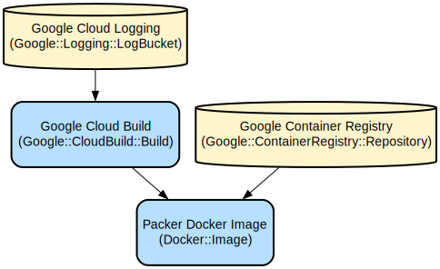

# Automated Packer Image Builder for Google Cloud Build

This project provides a containerized Packer environment for automated machine image building using Google Cloud Build. It streamlines the process of creating consistent machine images by combining HashiCorp Packer with Google Cloud's CI/CD capabilities.

The solution automates the entire workflow from setting up Packer in a containerized environment to executing Packer builds within Google Cloud Build pipelines. It uses a multi-stage Docker build process to create a minimal runtime environment with the Packer binary and Google Cloud SDK, enabling seamless integration with Google Cloud services.

## Repository Structure
```
.
├── cloudbuild.yml                 # Main Cloud Build configuration for running Packer builds
├── cloudbuild-packer-get.yml      # Cloud Build configuration for creating the Packer container image
└── Dockerfile                     # Multi-stage Dockerfile for building the Packer runtime environment
```

## Usage Instructions
### Prerequisites
- Google Cloud Platform account with billing enabled
- Google Cloud Build API enabled
- Container Registry API enabled
- Appropriate IAM permissions to:
  - Create and manage Cloud Build triggers
  - Push to Container Registry
  - Execute Cloud Build jobs

### Installation

1. Clone the repository:
```bash
git clone <repository-url>
cd <repository-directory>
```

2. Build and push the Packer container image:
```bash
gcloud builds submit --config=cloudbuild-packer-get.yml
```

### Quick Start

1. Create your Packer template file (e.g., `ubuntu.pkr.hcl`) and variables file (e.g., `variables.pkrvars.hcl`)

2. Execute a Packer build:
```bash
gcloud builds submit --config=cloudbuild.yml
```

### More Detailed Examples

#### Creating a Custom Packer Build Configuration
```hcl
# ubuntu.pkr.hcl
source "googlecompute" "ubuntu" {
  project_id = var.project_id
  zone       = var.zone
  image_name = var.image_name
}

build {
  sources = ["sources.googlecompute.ubuntu"]
}
```

#### Running a Build with Custom Variables
```bash
# Create a variables file
cat > variables.pkrvars.hcl << EOF
project_id = "your-project-id"
zone       = "us-central1-a"
image_name = "custom-ubuntu-image"
EOF

# Submit the build
gcloud builds submit --config=cloudbuild.yml
```

### Troubleshooting

#### Common Issues

1. **Packer Container Image Not Found**
   - Error: `Error: image not found in container registry`
   - Solution: Ensure you've run the `cloudbuild-packer-get.yml` build first:
   ```bash
   gcloud builds submit --config=cloudbuild-packer-get.yml
   ```

2. **Permission Issues**
   - Error: `Error: insufficient permissions`
   - Solution: Verify Cloud Build service account has required permissions:
   ```bash
   gcloud projects add-iam-policy-binding PROJECT_ID \
     --member="serviceAccount:PROJECT_NUMBER@cloudbuild.gserviceaccount.com" \
     --role="roles/compute.instanceAdmin.v1"
   ```

#### Debugging
- Enable verbose logging in Packer builds by adding `-debug` flag to Packer commands in `cloudbuild.yml`
- View build logs in Google Cloud Console under Cloud Build > History
- Check Cloud Build logs using:
```bash
gcloud builds log <BUILD_ID>
```

## Data Flow
The system processes image creation through a defined pipeline that starts with Packer configuration and ends with a machine image.

```ascii
[Packer Config] -> [Cloud Build] -> [Packer Container] -> [Machine Image]
     |                  |                   |                    |
     v                  v                   v                    v
  .hcl files    Build Triggers     Image Building Logic    Final Image
```

Component interactions:
1. Cloud Build triggers process the build configuration from `cloudbuild.yml`
2. The Packer container image is pulled from the container registry
3. Packer initializes the configuration using the specified template and variables
4. Packer executes the build process to create the machine image
5. Build logs are streamed to Cloud Logging
6. The resulting machine image is stored in Google Cloud

## Infrastructure



### Container Registry Resources
- Container Image: `us-central1-docker.pkg.dev/encoded-alpha-457108-e8/packer/packer`
  - Purpose: Hosts the Packer runtime environment

### Cloud Build Resources
- Build Configuration: `cloudbuild.yml`
  - Purpose: Defines the Packer build process
- Build Configuration: `cloudbuild-packer-get.yml`
  - Purpose: Creates and publishes the Packer container image

## Deployment

### Prerequisites
- Google Cloud SDK installed and configured
- Appropriate GCP project permissions

### Deployment Steps
1. Enable required APIs:
```bash
gcloud services enable cloudbuild.googleapis.com
gcloud services enable containerregistry.googleapis.com
```

2. Create the Packer container image:
```bash
gcloud builds submit --config=cloudbuild-packer-get.yml
```

3. Configure build triggers (optional):
```bash
gcloud beta builds triggers create cloud-build \
  --repo=<repository-url> \
  --branch=main \
  --build-config=cloudbuild.yml
```